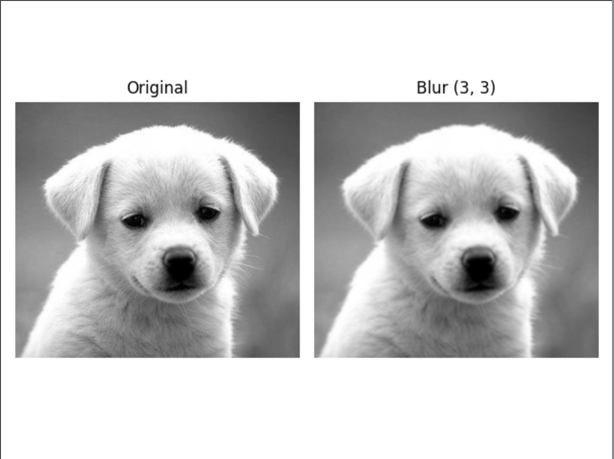

# Requirements
```bash
# create conda env
conda create --name=graphics python=3.6
source activate graphics 
```

# Tasks
* Custom convolution with sharpen and blur kernels `custom_convolution.py`
```bash
pip install opencv-python
pip install matplotlib
pip install numpy
```




* Image color histogram `color_histogram.py`
```bash
pip install opencv-python
pip install matplotlib
```

* Fractal tree `fractal_tree.py`


* Particle System (Spring Forces) for rendering fountain using OpenCL, folder `particle_system`
```bash
pip install opencv-python
pip install numpy
pip install pyopencl
```


* Histogram equalization
```bash
pip install opencv-python
pip install numpy
pip install matplotlib
```


